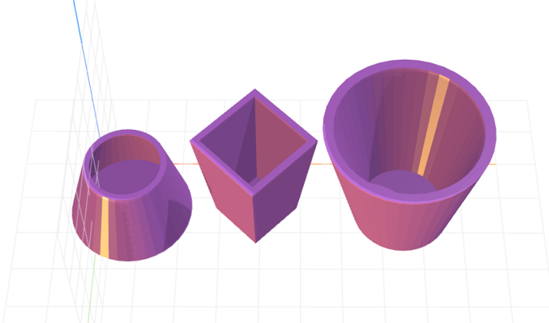

# craft-container
Parameterized container primitive for CraftML

### Install
    $ npm install craft-container

### Parameters
- baseRadius: adjusts base radius of container
- topRadius: adjusts top radius of container
- height: adjusts height of container
- thickness: adjusts thickness of container sides
- sides: adjusts number of container sides

### Example
```html
<craft>
    <craft name="basket" module="calebhsu/craft-container"/>
    <row spacing="1">
        <basket topRadius="10" baseRadius="15" height="20"></basket>
        <basket topRadius="15" baseRadius="10"  height="30" sides="4"></basket>
        <basket></basket>
    </row>
</craft>
```

